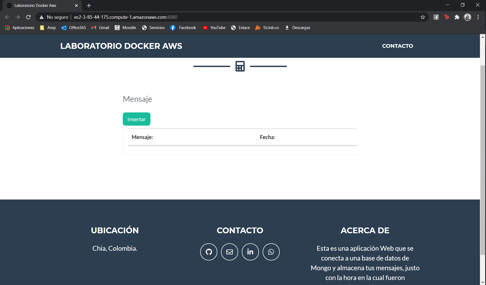
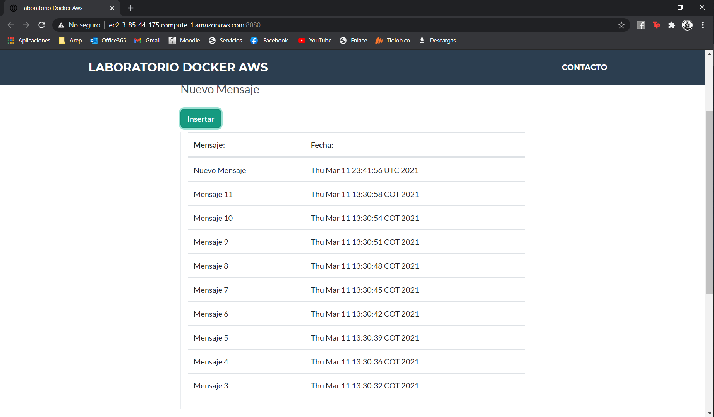
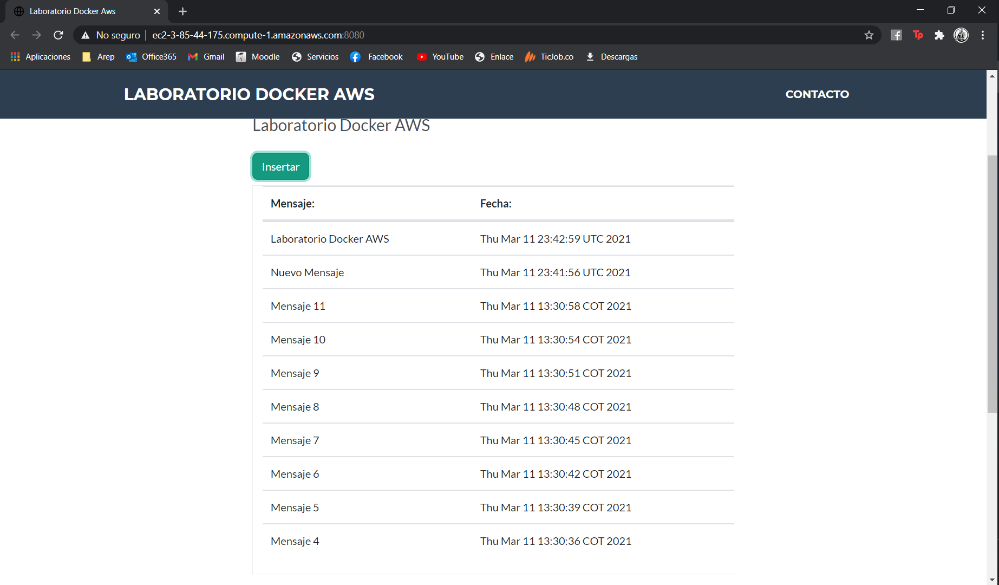
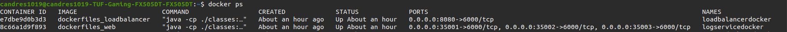

# Taller de modularización con virtualización e Introducción a Docker y a AWS

Aplicativo Web diseñado en Java con el objetivo de realizar una implementación del algoritmo RounRobin, con una
arquitectura basada en 3 nodos que realizaran consultas e inserciones sobre una misma base de datos MongoDB y un nodo
más que será el encargado de mostrar una interfaz amigable para el usuario para que este pueda insertar un mensaje a la
base de datos y además será el encargado de implementar el algoritmo RounRobin y mostrar los últimos 10 datos insertados
en la base de datos.

## Información Del Proyecto

* La documentación de las clases y los metodos del proyecto se encuentran divididas en los siguientes dos directorios:
    - [LogServie](./LogService/Javadoc/apidocs)
    - [load-balancer](./load-balancer/Javadoc/apidocs)

* Haga click [aqui]() para ver el reporte del proyecto.

### Pre-Requisitos

Para correr este proyecto necesita los siguientes programas instalados, se adjuntan los links de como descargarlos:

> * [Como Instalar Java 8](https://www.oracle.com/co/java/technologies/javase/javase-jdk8-downloads.html)
> * [Como Instalar Apache Maven](http://maven.apache.org/download.html#Installation)
> * [Como Instalar Docker](https://docs.docker.com/engine/install/)

Adicionalmente se recomienda tener descargado los siguientes programas:

> * [Como Instalar Git](http://git-scm.com/book/en/v2/Getting-Started-Installing-Git)

### Calidad del código

[](https://www.codacy.com/gh/Candres1019/TallerDockerAWS/dashboard?utm_source=github.com&amp;utm_medium=referral&amp;utm_content=Candres1019/TallerDockerAWS&amp;utm_campaign=Badge_Grade)

### Integración Continua

[](https://app.circleci.com/pipelines/github/Candres1019/TallerArquitecturas-IOC-Reflexion)

### Despliegue en AWS

[](http://ec2-3-85-44-175.compute-1.amazonaws.com:8080/)

1. Pagina Principal del despliegue:

   > 

2. Resultado despues de enviar el primer mensaje:

   > 

3. Resultado despues de enviar el segundo mensaje:

   > 

4. Imagenes docker corriendo dentro la maquina en AWS:


### Instalación

1. Clonación o Descarga del Proyecto:

    * Para **Clonar** el proyecto utilice el siguiente comando en la ventana de comandos:

   ```
   git clone https://github.com/Candres1019/TallerDockerAWS.git
   ```

    * Para **Descargar** el proyecto de click [aquí](https://github.com/Candres1019/TallerDockerAWS/archive/master.zip),
      la descarga comenzara de manera automática.

2. En una ventana de comandos ejecute el siguiente comando, dentro de la carpeta de cada uno de los proyectos.

    - LogService
    - load-balancer

   ```
    mvn package
    ```

3. Para ejecutar la aplicación de manera local utilizamos en la ventana de comandos el siguiente comando dentro del
   directorio DockerFiles:

   > ```
    > docker-compose up -d
    > ```

4. Para verificar que todo esté funcionando de manera correcta ejecutamos el siguiente comando:

   > ```
    > docker ps
    > ```

   debería ver algo similar a lo siguiente en la ventana de comandos:

   > 

5. Para ver el aplicativo web de manera local ingresamos al siguiente enlace:

   > ```
    > http://localhost:8080/
    > ```

6. Por defecto se creó la documentación JavaDoc y fue dejada en el directorio /Javadoc, si desea generar uno nuevo
   utilice el siguiente comando, esta documentación quedará en el directorio /target/site/apidocs :

   > ```
   > mvn javadoc:javadoc
   > ```

## Ejecución de pruebas

En una ventana de comandos, utilice el siguiente comando en cada uno de los directorios:

   - LogService
   - load-balancer

   ```
    mvn test
   ```

## Construido Con

* [Java 8](https://www.java.com/es/) - Lenguaje de Programación.
* [JUnit](https://junit.org/junit5/) - Pruebas de Unidad.
* [Maven](https://maven.apache.org/) - Manejo de dependecias.
* [IntelliJ IDEA](https://www.jetbrains.com/es-es/idea/) - Entorno de Desarrollo.

## Authors

* **Andres Mateo Calderón Ortega** - [Candres1019](https://github.com/Candres1019)

# Licencia

Este proyecto está licenciado bajo la GNU v3.0 - ver el archivo [LICENSE](./LICENSE) para más detalles